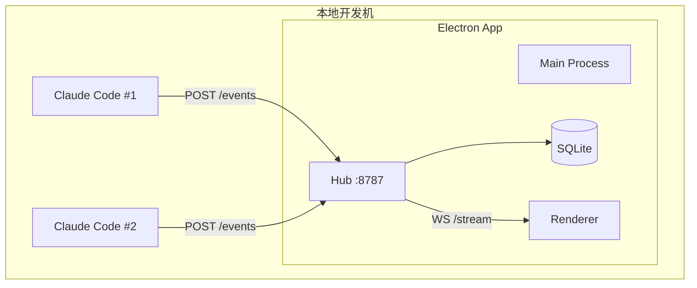

# Multi-Agent Control Console - Implementation Plan

**Electron** 桌面应用，本地 Hub + SQLite，支持未来上云。

---

## 系统架构



---

## Phase 1: MVP

### 项目结构

```
commanddeck/
├── apps/
│   ├── hub/                   # Fastify + WS (同端口)
│   │   ├── src/
│   │   │   ├── server.ts      # HTTP + WS upgrade
│   │   │   ├── store.ts       # SQLite
│   │   │   └── schema.ts      # Zod validation
│   │   └── package.json
│   └── desktop/               # Electron
│       └── src/
│           ├── main/
│           └── renderer/
├── packages/protocol/         # Shared types
└── scripts/claude-hooks/
```

---

### Event Protocol (Zod)

```typescript
import { z } from 'zod'

export const AgentEventSchema = z.object({
  agent_id: z.string(),
  project_id: z.string(),
  session_id: z.string().optional(),
  trace_id: z.string().optional(),      // Session 级追踪
  span_id: z.string().optional(),       // Tool 调用级
  type: z.enum([
    'session_start', 'session_end', 
    'tool_start', 'tool_end',
    'error', 'status', 'approval_request', 'model_switch'
  ]),
  state: z.enum([
    'IDLE', 'RUNNING', 'WAITING_USER', 'WAITING_APPROVAL', 'ERROR', 'DONE'
  ]),
  client_ts: z.string().optional(),     // Agent 本地时间
  payload: z.object({
    tool_name: z.string().optional(),
    message: z.string().optional(),
    model_name: z.string().optional(),
  }).optional()
})

// UI → Hub
export const CommandSchema = z.object({
  agent_id: z.string(),
  type: z.enum(['send_message', 'approve', 'retry', 'cancel']),
  payload: z.object({ text: z.string().optional() }).optional()
})

// UI 订阅请求
export const SubscribeSchema = z.object({
  project_id: z.string(),
  since_event_id: z.number().optional()  // 断线恢复
})
```

---

### Hub (单端口 HTTP + WS)

```typescript
// apps/hub/src/server.ts
import Fastify from 'fastify'
import websocket from '@fastify/websocket'
import { db } from './store'
import { AgentEventSchema, SubscribeSchema } from './schema'

const app = Fastify()
await app.register(websocket)

// HTTP: 接收事件
app.post('/events', async (req, reply) => {
  const result = AgentEventSchema.safeParse(req.body)
  if (!result.success) return reply.status(400).send(result.error)
  
  const event = result.data
  const serverTs = new Date().toISOString()
  const id = await db.insertEvent({ ...event, server_ts: serverTs })
  await db.upsertAgent(event.agent_id, event.project_id, event.state)
  
  broadcast({ ...event, event_id: id, server_ts: serverTs })
  return { ok: true, id }
})

// WS: 实时推送 + 断线恢复
app.get('/stream', { websocket: true }, (socket, req) => {
  socket.on('message', async (msg) => {
    const data = JSON.parse(msg.toString())
    
    if (data.type === 'subscribe') {
      const sub = SubscribeSchema.parse(data)
      // 断线恢复：发送缺失事件
      const events = await db.getEventsSince(sub.project_id, sub.since_event_id ?? 0)
      socket.send(JSON.stringify({ type: 'init', events }))
      clients.set(socket, sub.project_id)
    }
  })
  socket.on('close', () => clients.delete(socket))
})

app.listen({ port: 8787, host: '127.0.0.1' })
```

---

### SQLite Schema

```sql
CREATE TABLE events (
  id INTEGER PRIMARY KEY AUTOINCREMENT,
  agent_id TEXT NOT NULL,
  project_id TEXT NOT NULL,
  session_id TEXT,
  trace_id TEXT,
  span_id TEXT,
  type TEXT NOT NULL,
  state TEXT,
  payload TEXT,
  client_ts TEXT,
  server_ts TEXT NOT NULL
);

CREATE INDEX idx_events_project ON events(project_id, id DESC);
CREATE INDEX idx_events_agent ON events(agent_id, id DESC);

CREATE TABLE agents (
  id TEXT PRIMARY KEY,
  project_id TEXT NOT NULL,
  current_state TEXT DEFAULT 'IDLE',
  current_model TEXT,
  last_seen TEXT
);

CREATE INDEX idx_agents_project ON agents(project_id);
```

---

### Claude Code Hooks

```bash
#!/bin/bash
# scripts/claude-hooks/report-event.sh
HUB_URL="${AGENT_CONSOLE_URL:-http://127.0.0.1:8787}"
AGENT_ID="${AGENT_CONSOLE_AGENT_ID:-claude-default}"
PROJECT_ID="${AGENT_CONSOLE_PROJECT_ID:-default}"
EVENT_TYPE="$1"

INPUT=$(cat 2>/dev/null || echo '{}')
SESSION_ID=$(echo "$INPUT" | jq -r '.session_id // empty' 2>/dev/null || true)
TOOL_NAME=$(echo "$INPUT" | jq -r '.tool_name // empty' 2>/dev/null || true)

# State 映射
case "$EVENT_TYPE" in
  session_start|tool_start|tool_end) STATE="RUNNING" ;;
  session_end) STATE="DONE" ;;
  error) STATE="ERROR" ;;
  status_change) STATE="WAITING_USER" ;;  # Stop hook
  *) STATE="RUNNING" ;;
esac

curl -s --max-time 2 -X POST "$HUB_URL/events" \
  -H "Content-Type: application/json" \
  -d "{
    \"agent_id\": \"$AGENT_ID\",
    \"project_id\": \"$PROJECT_ID\",
    \"session_id\": \"$SESSION_ID\",
    \"type\": \"$EVENT_TYPE\",
    \"state\": \"$STATE\",
    \"client_ts\": \"$(date -u +%Y-%m-%dT%H:%M:%SZ)\",
    \"payload\": { \"tool_name\": \"$TOOL_NAME\" }
  }" &>/dev/null &
```

---

### 端口冲突处理

```typescript
// apps/hub/src/server.ts
async function findAvailablePort(start = 8787): Promise<number> {
  for (let port = start; port < start + 100; port++) {
    try {
      const server = net.createServer()
      await new Promise((resolve, reject) => {
        server.once('error', reject)
        server.listen(port, '127.0.0.1', () => {
          server.close(() => resolve(port))
        })
      })
      return port
    } catch {}
  }
  throw new Error('No available port')
}
```

---

## 今日验收标准

- [ ] Hub 启动 127.0.0.1:8787 (HTTP + WS 同端口)
- [ ] UI 连接 WS 并 subscribe，收到 init 事件
- [ ] `curl POST /events` 后 UI 实时显示
- [ ] Claude Code hooks 能区分 RUNNING/DONE/ERROR/WAITING
- [ ] 断线重连后，UI 能收到遗漏事件 (since_event_id)

---

## Phase 2: 上云

### CommandTransport 抽象（为上云预留）

```typescript
interface CommandTransport {
  send(agent_id: string, cmd: Command): Promise<void>
}

class LocalTransport implements CommandTransport {
  async send(agent_id: string, cmd: Command) {
    // 今天：只落库，UI 展示
    await db.insertCommand(agent_id, cmd)
  }
}

class RemoteTransport implements CommandTransport {
  // 下一版：通过 sidecar 反向连接下发
}
```

### 上云清单
- [ ] Hub 部署到 VPS
- [ ] 添加 Token 鉴权 (X-Agent-Token / X-UI-Token)
- [ ] Sidecar 反向连接（内网穿透）
